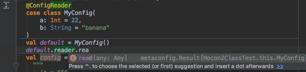

# Metaconfig

[](http://search.maven.org/#search%7Cga%7C1%7Ca%3A%22metaconfig-core_2.12%22)
[](https://travis-ci.org/olafurpg/metaconfig)
[](https://gitter.im/metaconfig/Lobby)
[](https://index.scala-lang.org/olafurpg/metaconfig/metaconfig-core) 

Aim of metaconfig: make it easy to support a large and deeply-nested set of
configuration options in a type-safe and user-friendly manner.

Key goals:
- No boilerplate (enabled with macro magic)
- Default settings are defined in regular Scala code (not configuration format!)
- Users override only the fields that differ from the default settings.
- Unknown fields in config file trigger error with useful message, e.g., "Invalid field 'maxs' in class T, did you mean 'max'?".
- Extensible, it's possible to read fields of any arbitrary type.
- Scala.js support (no runtime reflection).

Nice-to-have:

- IDE support, macro-generated fields appear in IntelliJ! 

Typesafe config (aka Hocon) is only supported for now.
Support for yaml, toml or other syntax should be straightforward to add.
The [metaconfig-hocon](https://github.com/olafurpg/metaconfig/blob/1d75ecb43a577a87e06682053d59e9dd9f5693cd/metaconfig-hocon/src/main/scala/metaconfig/hocon/Hocon2Class.scala)
implementation is only a few lines of code.

To use metaconfig:
```scala
libraryDependencies += "com.geirsson" % "metaconfig-core" % "latest.integration"
libraryDependencies += "com.geirsson" % "metaconfig-hocon" % "latest.integration"

// pass settings to projects using @ConfigReader annotation.
lazy val metaMacroSettings: Seq[Def.Setting[_]] = Seq(
  addCompilerPlugin(
    ("org.scalameta" % "paradise" % ParadiseVersion).cross(CrossVersion.full)),
  libraryDependencies += "org.scalameta" %% "scalameta" % MetaVersion % Provided,
  scalacOptions += "-Xplugin-require:macroparadise",
  scalacOptions in (Compile, console) := Seq(), // macroparadise plugin doesn't work in repl yet.
  sources in (Compile, doc) := Nil // macroparadise doesn't work with scaladoc yet.
)
```

## Example

Using `metaconfig-hocon`
```scala
@metaconfig.ConfigReader
case class MyConfig(
    a: Int,
    b: String
)
val default = MyConfig(22, "banana")
val config =
  """
    |a = 666
  """.stripMargin

test("field 'a' is overwritten") {
  val Right(obtained) =
    metaconfig.hocon.Hocon2Class.gimmeClass[MyConfig](config, default.reader)
  val expected = default.copy(a = 666)
  assert(obtained == expected)
}
```

## Modules

- `metaconfig-core` provides the `@metaconfig.ConfigReader` macro annotation to automatically generate a reader from a `Map[String, Any]` to your case class.
- `metaconfig-hocon` provides a way to convert `com.typesafe.Config` to `Map[String, Any]`.

## Used by

* scalafmt to read [over 60 configuration options](https://olafurpg.github.io/scalafmt/#Other)
* scalafix (soon)

## Alternatives

There are ton of great alternatives to metaconfig, to name a few:

- [Pureconfig](https://github.com/melrief/pureconfig)
- [Ficus](https://github.com/iheartradio/ficus)
- [Circe](https://github.com/circe/circe) "patch" readers, see [this SO answer](http://stackoverflow.com/a/39639397/1469245)

I did not find an alternative that fits my personal needs, so I created metaconfig
(I also wanted an excuse to use the new scala.meta macro system!).

